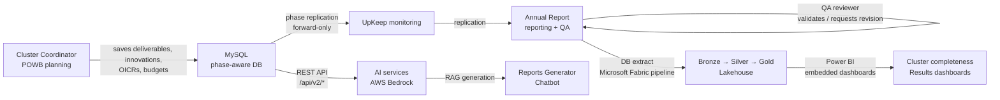

MARLO is a Java web application that stores research-management data in a **phase-aware MySQL database**, renders form-driven screens via Apache Struts 2, and exposes a REST API via Spring MVC. All production data sits in AWS (RDS + S3), feeds a Microsoft Fabric / Power BI analytics pipeline, and is consumed by AI services running on AWS Bedrock. This page explains how those pieces fit together and why the platform is designed the way it is.

## Phase-aware data model

The central design decision in MARLO is that **phases are first-class citizens**. Every record that changes over time — deliverables, innovations, partners, outcome impact case reports, budgets — carries an explicit `phase_id` foreign key.

The `phases` table enumerates every cycle moment across all programs:

| Phase name | When it is active | Typical work |
|---|---|---|
| **POWB** (Plan of Work and Budget) | Start of the year | Annual planning per cluster |
| **UpKeep** | Mid-year | Progress monitoring and adjustments |
| **Annual Report (AR)** | End of year | Narrative reporting, evidence upload, QA |

### Forward-only replication

<Note>
  Past phases are immutable. You cannot edit a record that belongs to a closed phase. This is a deliberate design constraint that preserves the audit trail.
</Note>

When you save a record in MARLO, the platform **replicates it forward** through all future phases automatically:

- A save in POWB replicates to UpKeep and to AR.
- A save in UpKeep replicates to AR.
- A delete follows the same chain — removing a deliverable from POWB removes it from all future phases.

This means teams never start from a blank slate when a new phase opens. Everything planned in POWB carries forward to AR, where coordinators confirm outcomes and attach evidence.

```
Phase timeline (forward-only):

  POWB 2026 ──save──► UpKeep 2026 ──save──► AR 2026
      │                                         │
      └── past phase (immutable after close) ───┘
                                    ▲
              new saves replicate forward only
```

## Multi-tenant model

MARLO runs multiple research programs on a single instance. Each program is called a **Global Unit**, which can be one of three types:

- **CRP** (CGIAR Research Program) — for multi-country, multi-cluster research programs such as AICCRA and CCAFS.
- **Platform** — for cross-cutting service platforms.
- **Center** — for CGIAR Centers with their own reporting requirements.

Each Global Unit has its own:

- Phases and annual cycle dates
- Roles and user assignments
- Partner and location data
- Feature flags ("specificities") that enable or disable program-specific behavior

URLs are scoped by the Global Unit acronym — for example `/projects/aiccra/description.do` — and the platform enforces this boundary through authentication interceptors on every request.

## How data flows: PMRL cycle



Data enters through **Struts 2 form actions** (cluster coordinators filling in sections), passes through the **manager layer** (which applies validation and phase replication), persists to **MySQL on AWS RDS**, and eventually flows into the **Microsoft Fabric Lakehouse** for analytics.

## Dual web architecture

MARLO uses two distinct web layers, each with a different responsibility:

### Struts 2 — form-driven UI

All interactive screens used by cluster coordinators, PMU staff, and QA reviewers are Struts 2 actions. URLs end in `.do`:

- `/projects/{crp}/projectDeliverable.do` — deliverable entry form
- `/powb/{crp}/financialPlan.do` — POWB financial plan
- `/annualReport/{crp}/melia.do` — AR MELIA section
- `/qualityAssessment/{crp}/detail.do` — QA review screen

Each action goes through an **interceptor stack** that checks authentication, session validity, and edit permissions before the form loads or saves.

### Spring MVC — REST API

External integrations use the REST API under `/api/v2/*`. These endpoints are used by:

- The **CLARISA** reference-data service (institutions, geographies, taxonomies)
- **Power BI / Microsoft Fabric** ingestion pipelines
- **AWS AI services** (Reports Generator, Chatbot, Text Mining)
- Quality assurance token-based clients

```
Request routing:

  Browser request to /*.do  ──► Struts 2 interceptor stack ──► Action class ──► FreeMarker view
  API request to /api/v2/*  ──► Spring MVC controller ──► DTO ──► JSON response
```

<Note>
  Struts 2 is explicitly excluded from handling `/api/*` paths. These two layers do not overlap. All form-based user interactions go through Struts; all machine-to-machine integrations go through Spring MVC.
</Note>

## Module structure

MARLO is a multi-module Maven project. The modules divide responsibility cleanly:

| Module | What it contains |
|---|---|
| `marlo-data` | 540+ JPA entities, Manager interfaces and implementations, DAOs, audit listeners. The domain layer. |
| `marlo-web` | Struts actions, Spring MVC REST controllers, FreeMarker templates, validators, interceptors, Flyway SQL migrations, frontend assets. |
| `marlo-core` | Cross-cutting configuration: Apache Shiro security wiring, Hibernate session factory, database config. |
| `marlo-utils` | Pure utility classes for dates, strings, Excel/CSV/PDF processing, and JSON helpers. |
| `marlo-parent` | Root Maven aggregator — declares dependency versions and plugin configuration. No executable code. |

Every persisted entity in `marlo-data` follows a four-layer pattern:

```
Manager interface  ──  defines business operations
ManagerImpl        ──  implements logic + phase replication
DAO interface      ──  defines persistence operations
MySQLDAO           ──  Hibernate implementation (HQL / SQL)
```

New code must not bypass the manager layer to talk to the DAO directly.

## Integration points

| Integration | Direction | Purpose |
|---|---|---|
| **CGIAR Active Directory** | Inbound (auth) | Enterprise single sign-on via Apache Shiro |
| **CLARISA** | Outbound (REST) | Reference data: institutions, countries, partner types, taxonomies |
| **Microsoft Fabric / Power BI** | Outbound (extract + embed) | Bronze / Silver / Gold Lakehouse; embedded dashboards refreshed every 8 hours (results) and 30 minutes (QA) |
| **AWS Bedrock (Claude, Titan)** | Outbound | AI narrative generation, embeddings, RAG pipelines |
| **Amazon OpenSearch** | Outbound | Vector indices for Reports Generator and Chatbot |
| **AWS S3** | Outbound | Document storage, daily backups |
| **CGSpace** | Outbound (REST) | Open-access deposit metadata and DOI lookup |
| **Pusher** | Outbound (WebSocket) | Real-time in-platform notifications |

### CLARISA

CLARISA is the CGIAR reference-data service. MARLO calls CLARISA to populate institution selectors, geographic lookups, and partner-type lists. These tables are read-only from the MARLO user perspective — do not hand-edit CLARISA-backed records directly in the database.

### Power BI and Microsoft Fabric

Operational data is extracted from MySQL and ingested into a Microsoft Fabric Lakehouse following a Bronze (raw) → Silver (cleaned) → Gold (aggregated) pipeline. Power BI dashboards are embedded directly in MARLO screens and in a public embed tool. Key dashboards include cluster completeness status, QA progress, and results indicators.

### AI services

Three AI capabilities are available when enabled for a program:

- **Text Mining** — surfaces related literature and prior results from MARLO data.
- **Reports Generator** — produces cluster-level narratives grounded in structured MARLO records using AWS Bedrock (Claude) and Amazon OpenSearch vector indices.
- **Chatbot** — conversational interface for exploring program data.

All AI services consume MARLO data through the REST API or the database. They do not write back to MARLO directly.

## Security model

Authentication uses **Apache Shiro** with the CGIAR Active Directory as the primary identity realm. An internal MD5-backed fallback exists for programs that do not use CGIAR AD.

Authorization is layered:

1. **Identity** — the `users` table identifies the person.
2. **Program access** — the `crp_users` table controls which Global Units a user can enter.
3. **Role assignment** — the `user_role` table controls what a user can do within a program.

Roles include: Super Admin, Admin, Project/Cluster Leader, Project/Cluster Coordinator, PMU, QA Reviewer, and Guest User.

Every mutating Struts action is protected by a named interceptor stack that checks the appropriate edit permission (`canEditProject`, `canEditDeliverable`, `canEditPowbSynthesis`, etc.) before the action class runs.

## Next steps

<CardGroup cols={2}>
  <Card title="Annual planning workflow" icon="calendar-check" href="/workflows/annual-planning">
    Walk through what cluster coordinators do during the POWB phase
  </Card>
  <Card title="Quality assurance" icon="shield-check" href="/workflows/quality-assurance">
    How the QA review cycle works across phases
  </Card>
  <Card title="Analytics and Power BI" icon="chart-line" href="/analytics/power-bi">
    How MARLO data flows into the Fabric Lakehouse and Power BI dashboards
  </Card>
  <Card title="Developer: phase replication" icon="code" href="/developer/phase-replication">
    Technical details of the ManagerImpl forward-only replication contract
  </Card>
</CardGroup>
